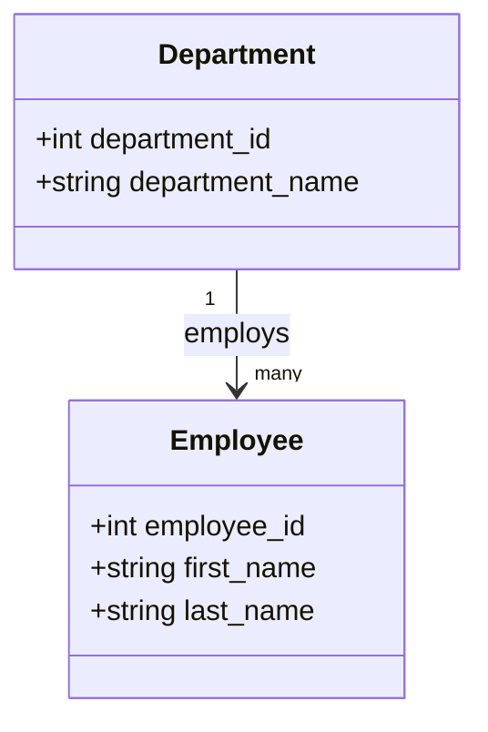

# Hello DBMS+

Repository for the **Hello DBMS+** assignment:
- **Veille scientifique** (A → J) with simple metaphors + diagrams
- **SQL Jobs 1 → 9** (one script per job)
- **Big Job**: Flask Carbon Footprint Calculator (MySQL + Flask)
- **Slides** in `/presentation`

---

## Quick start (Windows / MySQL)

1) Create a virtualenv and install dependencies:
```bash
python -m venv .venv
.venv\Scripts\activate
pip install -r requirements.txt
```

2) Initialize MySQL databases + tables + imports (world + carbon + uefa + somecompany):
```bash
python scripts/init_mysql.py
```

3) Run the Flask app:
```bash
python app/app.py
```
Then open: http://127.0.0.1:5000

4) Run SQL jobs:
- Open each file in `/sql/jobX.sql` and execute it in MySQL Workbench (or your SQL client).

> **Data sources**
- `data/countries of the world.csv` (world countries)
- `data/carbon-footprint-data.csv` (energy mix by country)
- External references used in the veille:  
  - Statista data volume: https://www.statista.com/statistics/871513/worldwide-data-created/  
  - CO₂ per tree (order of magnitude): https://ecotree.green/combien-de-co2-absorbe-un-arbre

---

# 📚 Veille scientifique (A → J)

## A) Qu’est-ce qu’une donnée ? Sous quelle forme ?
**Définition simple :** une *donnée* = un fait brut (un chiffre, un texte, un signal) qui **n’a pas de sens complet** tant qu’on ne l’interprète pas.

- **Formes possibles :**
  - **Structurée** : tableau (CSV), base SQL (lignes/colonnes)
  - **Semi-structurée** : JSON, XML (structure souple)
  - **Non structurée** : texte libre, images, audio, vidéo
  - **Temps réel / capteurs** : logs, IoT, séries temporelles

**Métaphore :**  
- Données = **ingrédients** (farine, oeufs)  
- Information = **recette appliquée** (un gâteau)  
- Connaissance = **savoir quand et pourquoi** faire ce gâteau (pour un anniversaire)

---

## B) Critères de qualité des données
- **Exactitude** : vrai / conforme à la réalité
- **Complétude** : pas de champs importants manquants
- **Cohérence** : pas de contradictions (ex: âge négatif)
- **Unicité** : pas de doublons indésirables
- **Actualité** : données à jour
- **Validité** : respecte le format (date, email, etc.)
- **Traçabilité** : on sait d’où ça vient, quand, comment

**Métaphore :** ton GPS : si la carte est vieille ou fausse, tu peux avoir le meilleur moteur… tu vas te perdre.

---

## C) Data Lake vs Data Warehouse vs Lakehouse (+ schéma)
- **Data Lake** : stocke *brut* (cheap), tous formats, “schema-on-read”
- **Data Warehouse** : stocke *propre* (modélisé), BI/Reporting, “schema-on-write”
- **Lakehouse** : combine lake + contraintes/transactions

```mermaid
flowchart LR
  S[Sources: apps, IoT, fichiers, API] --> L[Data Lake (raw)]
  S --> W[Data Warehouse (curated)]
  L --> H[Lakehouse (raw + gouvernance/ACID-like)]
  W --> BI[BI / Reporting]
  H --> BI
  H --> ML[ML / Data Science]
```

**Métaphore :**
- Lake = **entrepôt brut** où tu poses tout
- Warehouse = **supermarché** rangé par rayons
- Lakehouse = **entrepôt** mais avec **rayonnage + règles**

---

## D) SGBD / DBMS : définition + exemples
Un **SGBD (DBMS)** = logiciel qui gère une base : stockage, requêtes, sécurité, transactions.

- **SQL** : MySQL, PostgreSQL, SQL Server
- **NoSQL** : MongoDB, Redis, Neo4j

**Métaphore :** le **bibliothécaire**.

---

## E) Base relationnelle vs non relationnelle
| Aspect | SQL (relationnel) | NoSQL (non relationnel) |
|---|---|---|
| Modèle | tables + relations | documents / key-value / graph |
| Schéma | rigide (schema-on-write) | flexible (schema-on-read) |
| Fort | intégrité, joins, ACID | flexibilité, scalabilité |
| Exemples | MySQL, PostgreSQL | MongoDB, Cassandra |

---

## F) Clé primaire / clé étrangère
- **PK** : identifiant unique
- **FK** : référence vers une autre table

---

## G) Propriétés ACID
- Atomicité, Cohérence, Isolation, Durabilité

---

## H) Merise et UML : utilité + schémas
- **Merise** : MCD/MLD/MPD
- **UML** : classes/séquence/cas d’utilisation



---

## I) SQL : définition + commandes + jointures
- DML / DDL / DCL / TCL

> FULL OUTER JOIN : MySQL ne le supporte pas directement, on le simule avec `LEFT JOIN ... UNION ... RIGHT JOIN`.

---

## J) Expliquer simplement (public non initié)
Toujours: utilité + fonctionnement en 1 phrase + métaphore.

---

## Lexique
- **Table** : feuille Excel
- **Index** : sommaire pour accélérer
- **ETL** : Extract / Transform / Load

